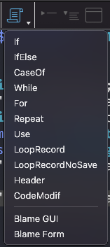
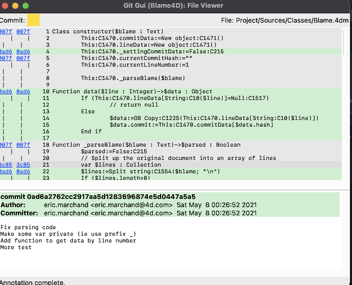
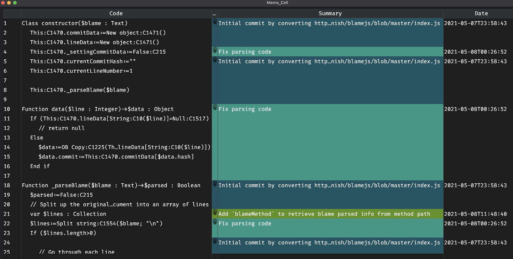

# Blame4D

[![language][code-shield]][code-url]
[![language-top][code-top]][code-url]
![code-size][code-size]
[](https://github.com/mesopelagique/Blame4D/actions/workflows/build.yml)
[![release][release-shield]][release-url]
[![license][license-shield]][license-url]
[![discord][discord-shield]][discord-url]

Get `git blame` information for methods and classes, by code or by launching a graphical interface on current file in method editor using macro.

## Install component

To install this component into your 4D, download it, rename it with `.4dbase` extension and move it manually to the `Components` folder of your 4D app or into your database.

or use [kaluza command line interface](https://mesopelagique.github.io/kaluza-cli/) and do `kaluza install -g mesopelagique/Blame4D`

or v19 component [DeployComponent](https://github.com/mesopelagique/DeployComponent)

## Macro

This component add two macro to display blame result on current method or class.



### Blame GUI

This macro launch the native git gui blame graphical interface on current method.



- https://git-scm.com/docs/git-gui
- https://github.com/prati0100/git-gui/

You need a recent git (>=2.31.1).

> On macOs to upgrade git you could use `brew install git` with [brew](https://brew.sh/)
> For git gui: `brew install git-gui`

And if it is not enough install git gui manually

> [Download source](https://github.com/prati0100/git-gui/releases) then use `make` and `make install`.

### Blame Form

This macro launch the a 4D form with blame result on current method.



This form have not all functionnalities of `git blame gui`, but this do the job for most cases.

### Limitation

4D macro system seems to not allow me to get selected lines, so I cannot limit blame to selected lines.

## How to by code

### From command output

```4d
$blame:=blame($blameOut)
```

with `$blameOut` the result of the git blame operation using -p (porcelain) option.

For instance `git blame -p 'Project/Sources/Classes/Blame.4dm'`

> You could launch git command with `LAUNCH EXTERNAL PROCESS`

#### Get lines and commit data

```4d
// Get the commit data object
$commitData = $blame.commitData

// Get the line data object
// each item containing a reference(the hash) to commits that can be then referenced in commitData
$lineData = $blame.lineData
```

#### Get data for a specific line

```4d
$lineData = $blame.data(5) 
```

It's equivalient to `$lineData["5"]` merged with `$commitData[$lineData["5"].hash]`

## From method path in current database

```4d
$blame:=blameMethod($methodPath) // for instance blameMethod(Current method path)
```

## Acknowledgement

Code to parse blame output converted from Javascript project [blamejs](https://github.com/mnmtanish/blamejs) with [Mesopotamia](https://github.com/mesopelagique/Mesopotamia)

## Other components

[](https://mesopelagique.github.io/)

<!-- MARKDOWN LINKS & IMAGES -->
<!-- https://www.markdownguide.org/basic-syntax/#reference-style-links -->
[code-shield]: https://img.shields.io/static/v1?label=language&message=4d&color=blue
[code-top]: https://img.shields.io/github/languages/top/mesopelagique/Blame4D.svg
[code-size]: https://img.shields.io/github/languages/code-size/mesopelagique/Blame4D.svg
[code-url]: https://developer.4d.com/
[release-shield]: https://img.shields.io/github/v/release/mesopelagique/Blame4D
[release-url]: https://github.com/mesopelagique/Blame4D/releases/latest
[license-shield]: https://img.shields.io/github/license/mesopelagique/Blame4D
[license-url]: LICENSE.md
[discord-shield]: https://img.shields.io/badge/chat-discord-7289DA?logo=discord&style=flat
[discord-url]: https://discord.gg/dVTqZHr
